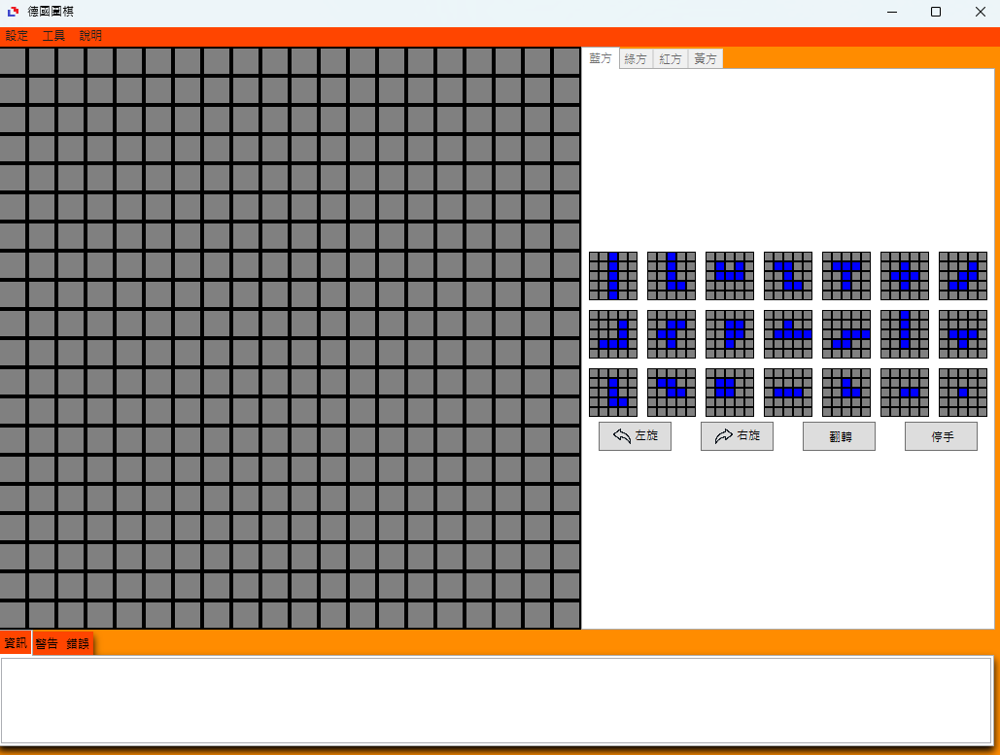

# Board Game Playground

**The project has reached the completion of its staged development but this markdown file is still being edited and not all content has been completed yet.**

# 1. Introduction

This project was developed in my spare time, inspired by my and a few friends' love for board games. However, due to the restrictions of the pandemic, we were unable to meet in person. Consequently, I created this simple online board game software, allowing us to continue enjoying our gaming sessions through the internet. Initially, to quickly share this joy with my friends, I designed some basic features. In the future, if the opportunity and time arise, I hope to further improve and optimize this software.

I will briefly introduce the functionality and usage of this software in the following section. Everyone is welcome to download and test it from GitHub. If there are any questions, feel free to email me.

# 2. software description

## 2.1. Game Menu

## 2.2. The First Game - Blokus

(Flowchart will be updated soon)

(Explaination will be updated soon)

## 2.3. The Second Game - Chinese Checkers

(Flowchart will be updated soon)

(Explaination will be updated soon)

